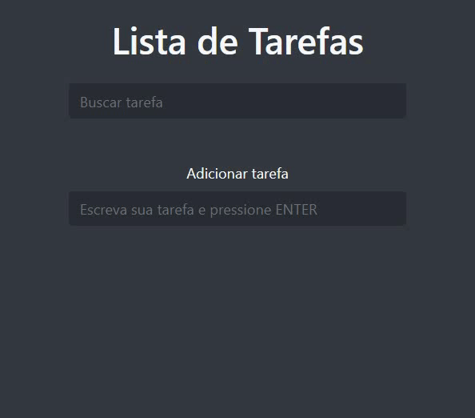

<h1 align="center">Lista de Tarefas</h1>

  <a href="#-app">Aplicação</a>   | 
  <a href="#-tecnologias">Tecnologias</a>   |   
  <a href="#-page">Page</a>   
  

  

     

## 📝 Aplicação

> Aplicação Web que permite o usuário adicionar, remover ou pesquisar uma tarefa. 

## 🚀 Tecnologias

- **HTML**

- **Bootstrap**

- **JavaScript**
  
  

## 🔖 Page

- Você pode visualizar o resultado final do projeto através [desse link](https://angelicacamp.github.io/to-do-list/).

---

Feito com ♥ by Angélica C.
